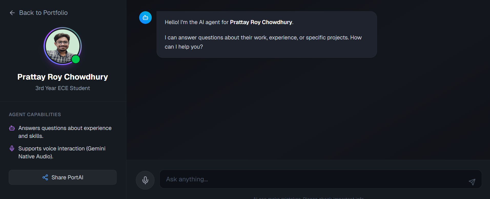

# PortfolioHub
[](https://deepwiki.com/Prattaykun/portfoliohub)

PortfolioHub is a sleek, modern platform designed for developers and engineers to effortlessly build, manage, and showcase their professional journey. It features a step-by-step guided process to create a comprehensive, shareable portfolio page with dedicated sections for your bio, skills, education, projects, and more.

The application provides a user-friendly dashboard for managing portfolio content and instantly generates a public-facing, animated portfolio page at a unique username URL.
[](https://github.com/Prattaykun/portfoliohub/releases)
## Key Features

-   **Dynamic Public Portfolios**: Instantly generate a shareable portfolio page at `your-domain/[username]` with engaging animations and a particle background.
-   **Seamless Onboarding**: Intuitive, multi-step forms guide you through building each section of your portfolio, from personal profile and bio to projects and skills.
-   **Comprehensive Content Sections**: Detail your professional life with dedicated sections for:
    -   **Profile**: Name, photo, and personal details.
    -   **About**: Bio, roles, education, and work experience.
    -   **Skills**: Separate inputs for technical and soft skills with search and auto-fill.
    -   **Projects**: Showcase your work with titles, descriptions, tech stacks, media (images/videos), and repository links.
    -   **Dynamic Media Sections**: Add multiple sections for Achievements, Services, Testimonials, extracurriculars, and more.
    -   **Contact**: Share your email, phone, and social links (LinkedIn, GitHub, etc.).
    -   **Language & Interests**: Add spoken languages and personal interests.
-   **AI Chatbot Assistant**: A fully integrated, context-aware AI assistant ("PortAI") that:
    -   **Answers Visitor Queries**: Uses your portfolio data (bio, projects, skills) to answer questions about you.
    -   **Voice Interaction**: Supports real-time voice conversations.
    -   **Robust AI Logic**:
        -   **Primary (Audio)**: Uses **Gemini 2.5 Flash** for native multimodal audio understanding.
        -   **Fallback (Audio)**: Automatically switches to **Groq** (Distil-Whisper Large V3 for transcription + Llama 3.3 70B for response) if Gemini fails or hits rate limits.
        -   **Text Chat**: Powered by **Groq Llama 3.3 70B** for lightning-fast text responses.
    -   **Deep Linking**: Intelligently links users to specific sections of your portfolio (e.g., "Show me his projects" -> scrolls to #projects).
    -   **Responsive Design**: Features a custom mobile interface with a story-style profile header and a desktop sidebar for easy navigation.
    -   **Shareable**: Easily share the chatbot via a dedicated link or QR code.



-   **Secure Authentication**: Secure sign-up and login with email/password or via OAuth providers (Google, GitHub, LinkedIn).
-   **Automated Resume Generation**: Generate and download a professional PDF resume directly from your portfolio data using Puppeteer.
-   **Media Management**: Easily upload profile photos, project media, and resumes using a Cloudinary widget.
-   **User Dashboard**: A centralized dashboard to navigate and edit all sections of your portfolio.
-   **PWA and Android Packaging**: Install PortfolioHub as a Progressive Web App, use Android share-targets and protocol handlers, and build APK/AAB artifacts with Bubblewrap from GitHub Actions.

## Tech Stack

-   **Framework**: [Next.js](https://nextjs.org/) (App Router)
-   **Language**: [TypeScript](https://www.typescriptlang.org/)
-   **AI & LLMs**:
    -   [Groq SDK](https://groq.com/):
        -   **Llama 3.3 70B Versatile**: For high-speed text inference and rationale.
        -   **Distil-Whisper Large V3**: For audio transcription during fallback.
    -   [Google Generative AI](https://ai.google.dev/) (Gemini 2.5 Flash): Primary model for native multimodal (audio) understanding.
-   **Backend & Database**: [Supabase](https://supabase.io/) (Authentication, Postgres DB, Storage)
-   **Styling**: [Tailwind CSS](https://tailwindcss.com/)
-   **Animations**: [Framer Motion](https://www.framer.com/motion/)
-   **File & Image Uploads**: [Cloudinary](https://cloudinary.com/)
-   **PDF Generation**: [Puppeteer](https://pptr.dev/) & [Browserless](https://www.browserless.io/) (for deployment)

-   **UI Components**: Lucide React, React Slick, React Datepicker

## Getting Started

Follow these steps to set up and run the project locally.

### Prerequisites

-   Node.js (v18 or later)
-   npm, yarn, or pnpm
-   A Supabase account
-   A Cloudinary account

### 1. Clone the Repository

```bash
git clone https://github.com/prattaykun/portfoliohub.git
cd portfoliohub
```

### 2. Install Dependencies

```bash
npm install
# or
yarn install
# or
pnpm install
```

### 3. Set Up Environment Variables

Create a `.env.local` file in the root of the project and add the following environment variables. You can get these from your Supabase and Cloudinary dashboards.

```env
# Supabase
NEXT_PUBLIC_SUPABASE_URL=YOUR_SUPABASE_URL
NEXT_PUBLIC_SUPABASE_ANON_KEY=YOUR_SUPABASE_ANON_KEY
SUPABASE_SERVICE_ROLE_KEY=YOUR_SUPABASE_SERVICE_ROLE_KEY

# Cloudinary
NEXT_PUBLIC_CLOUDINARY_CLOUD_NAME=YOUR_CLOUDINARY_CLOUD_NAME
NEXT_PUBLIC_CLOUDINARY_API_KEY=YOUR_CLOUDINARY_API_KEY
CLOUDINARY_API_SECRET=YOUR_CLOUDINARY_API_SECRET
NEXT_PUBLIC_CLOUDINARY_UPLOAD_PRESET=YOUR_CLOUDINARY_UPLOAD_PRESET

# App URL (for OAuth callbacks and resume generation)
NEXT_PUBLIC_APP_URL=http://localhost:3000
NEXT_PUBLIC_SITE_URL=http://localhost:3000
NEXT_PUBLIC_BROWSERLESS_API_KEY= 
#no need if you use next env variable as 'generate-resume1' as it will use #puppeteer, not browserless
NEXT_PUBLIC_GENERATE_RESUME_ENDPOINT=generate-resume #generate-resume1 on local server

# Optional PWA push notifications
NEXT_PUBLIC_WEB_PUSH_PUBLIC_KEY=
WEB_PUSH_PRIVATE_KEY=
WEB_PUSH_SUBJECT=mailto:you@example.com

# Optional TWA verification on the deployed site
ANDROID_APP_PACKAGE_ID=
ANDROID_SHA256_FINGERPRINTS=
```

### 4. Set Up Supabase Backend

1.  Go to your Supabase project dashboard.
2.  Use the SQL Editor to create the necessary tables. The schema can be inferred from the files in `app/api/` and `util/types.ts`. Key tables include:
    -   `user_profiles`
    -   `users_usernames`
    -   `about`
    -   `skills`
    -   `project`
    -   `contact`
    -   `langint`
    -   `resumes`
    -   `social`, `companies`, `schools` (for autocomplete data)
3.  In the Supabase Authentication settings, configure your desired OAuth providers (Google, GitHub, LinkedIn). Make sure to add `http://localhost:3000/auth/callback` to the list of redirect URLs.

### Project Schema

The `project` table stores an array of `ProjectItem` objects in the `projects` JSONB column. A `ProjectItem` includes:
-   `id`: string
-   `title`: string
-   `role`: string
-   `overview`: string
-   `process`: string
-   `results`: string
-   `techStack`: Array of `{ name, logo_url }`
-   `media`: Array of `{ id, type, url }`
-   `repoLink`: string
-   `links`: Array of `{ id, label, url }` (New: Renamable custom links)

### 5. Run the Development Server

```bash
npm run dev
```

Open [http://localhost:3000](http://localhost:3000) in your browser to see the application running.

## PWA and Android Build

-   The installed PWA and the Bubblewrap-generated Android app still call the same deployed route handlers, for example `https://portfoliohub-pi.vercel.app/api/chatbot`. `app/api` being part of the Next.js app is not a blocker.
-   The app now exposes a proper web manifest, service worker, share-target route, protocol handler route, and a dynamic `/.well-known/assetlinks.json` endpoint for TWA verification.
-   Native Android home-screen widgets are not part of the standard PWA/TWA feature set. The closest standards-based equivalents here are installable app shortcuts, delegated notifications, and share/protocol entry points.

### GitHub Action Secrets and Variables

Add these before running `.github/workflows/android-twa.yml`:

-   Repository variable `ANDROID_APP_PACKAGE_ID`
-   Optional repository variables `ANDROID_APP_NAME` and `ANDROID_LAUNCHER_NAME`
-   Repository secret `ANDROID_KEYSTORE_BASE64`
-   Repository secret `ANDROID_KEY_ALIAS`
-   Repository secret `ANDROID_KEYSTORE_PASSWORD`
-   Repository secret `ANDROID_KEY_PASSWORD`

If Android signing secrets are missing, the workflow now falls back to an **unsigned debug APK** build automatically.

### Versioned APK Releases on GitHub

-   The workflow now builds an APK and publishes it directly to GitHub Releases (Play Store is not required).
-   Manual run: open `Build Android TWA` workflow, set `version_name` (for example `1.0.3`) and `version_code`, then run.
-   Tag run: pushing a tag like `v1.0.3` also triggers a build and creates/updates that release.
-   Release assets include `app-release-signed.apk`, `assetlinks.generated.json`, and `twa-manifest.json`.

### Build on Every New Commit (Main Branch)

To make the workflow build automatically on each new commit, do this once:

1. Add repository variable:
    - `ANDROID_APP_PACKAGE_ID`
2. Add repository secrets:
    - `ANDROID_KEYSTORE_BASE64`
    - `ANDROID_KEY_ALIAS`
    - `ANDROID_KEYSTORE_PASSWORD`
    - `ANDROID_KEY_PASSWORD`
3. Push commits to `main`:

```bash
git add .
git commit -m "your message"
git push origin main
```

What happens after push to `main`:
- The `Build Android TWA` workflow runs automatically.
- If signing secrets exist, it builds a **signed APK** and uploads it as a workflow artifact.
- If signing secrets are missing, it builds an **unsigned debug APK** and uploads it as a workflow artifact.
- It does **not** create a GitHub Release for normal branch commits.

To create a versioned Release (APK attached), push a version tag:

```bash
git tag v1.0.3
git push origin v1.0.3
```

Tag/manual release output:
- With signing secrets: signed release APK + assetlinks + manifest
- Without signing secrets: unsigned debug APK + manifest (marked as pre-release)

### TWA Verification

-   After the workflow runs, it uploads `assetlinks.generated.json` as an artifact.
-   Put the reported SHA-256 fingerprint value into `ANDROID_SHA256_FINGERPRINTS` in your deployed environment so `/.well-known/assetlinks.json` serves the correct relation for Chrome verification.
